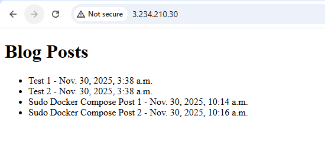
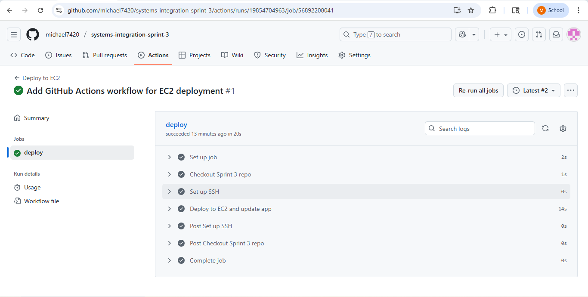
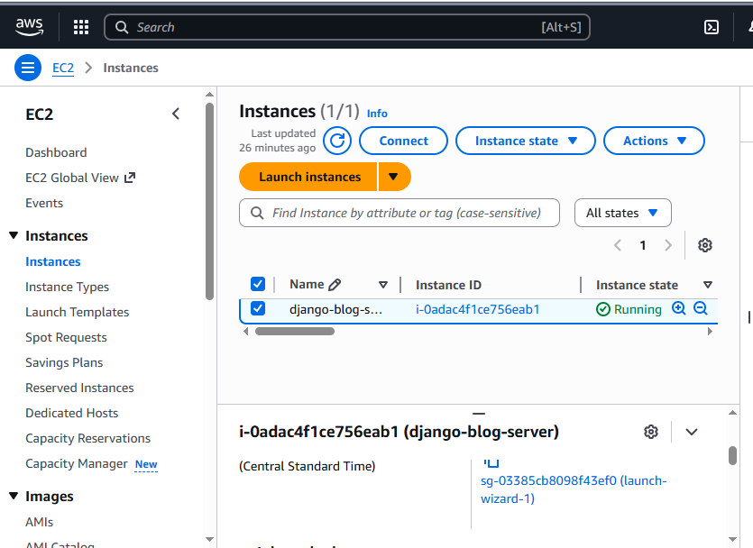
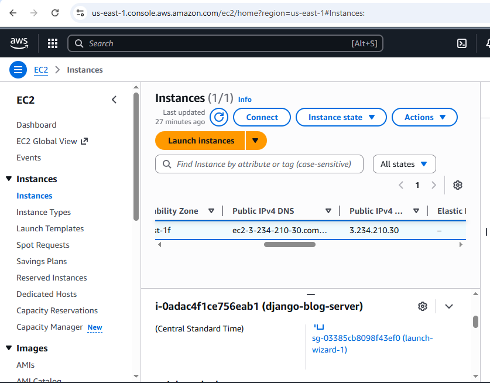

# systems-integration-sprint-3
Sprint 3 - Deploying Django Blog to EC2 with CI/CD

# Sprint 3 – EC2 Deployment and CI/CD

In Sprint 3, I deployed my Dockerized Django blog application to an AWS EC2 instance and automated the deployment process using GitHub Actions. The purpose of this sprint was to move the blog from local Docker (Sprint 2) to a cloud-hosted environment and set up a CI/CD pipeline that automatically deploys changes whenever I push updates to GitHub.

I created an Ubuntu-based EC2 instance, installed Python, Docker, Docker Compose, and Nginx, and configured Nginx as a reverse proxy. This allowed the EC2 instance to serve the Django application running in Docker on port 8000 through port 80. After cloning my Sprint 2 repository onto the EC2 instance, I built and ran the Docker containers so the blog could be accessed using the EC2 public IP address.

For CI/CD, I added a GitHub Actions workflow (`.github/workflows/deploy.yml`) in this Sprint 3 repository. The workflow uses the EC2 SSH private key and host IP stored as GitHub Secrets. When a push is made to the main branch of this repository, the workflow connects to the EC2 instance, pulls the latest code inside the Sprint 2 directory, and restarts the Docker containers. This eliminates the need to manually SSH into the server for each update.

---

## Images

### 1. Deployed Blog on EC2  
This screenshot shows the Django blog homepage loaded using the EC2 public IP. It verifies the Docker container, Django app, and Nginx reverse proxy are working together successfully.

---

### 2. Successful GitHub Actions Deployment  
This screenshot shows the GitHub Actions workflow run with a green check mark. It confirms the CI/CD pipeline successfully connected to EC2, pulled changes, and rebuilt the containers.

---

### 3. EC2 Instance Running (View 1)  
This screenshot displays the EC2 instance in the AWS Console in a running state, showing instance name and public IP address.

---

### 4. EC2 Instance Running (View 2)  
This additional screenshot provides another view of the EC2 instance information for documentation.

